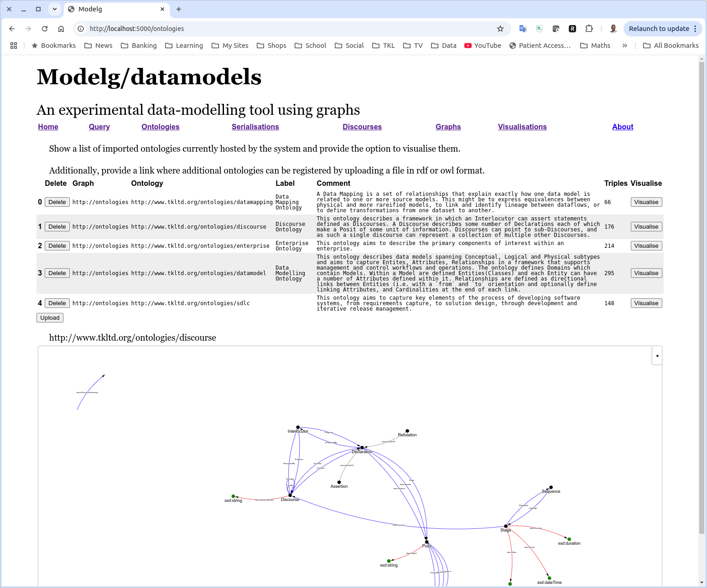
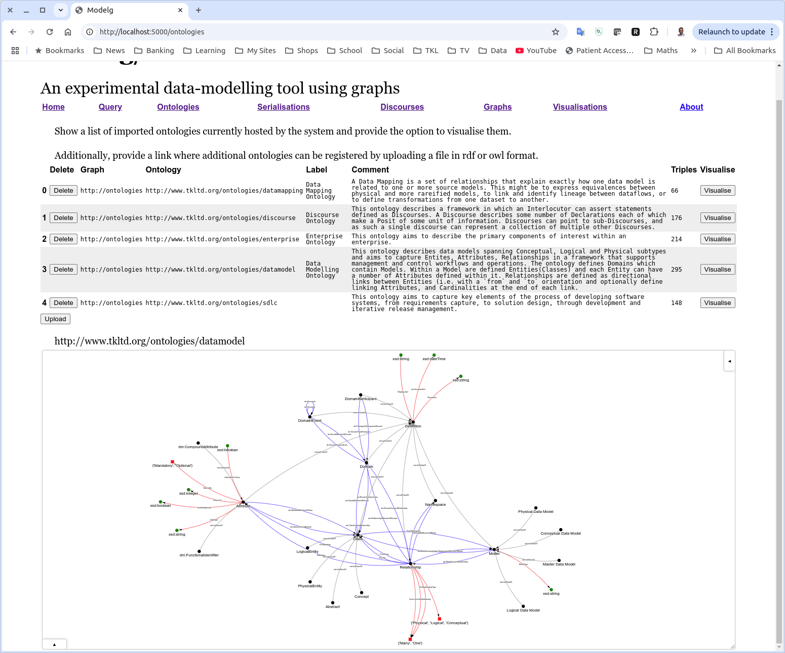
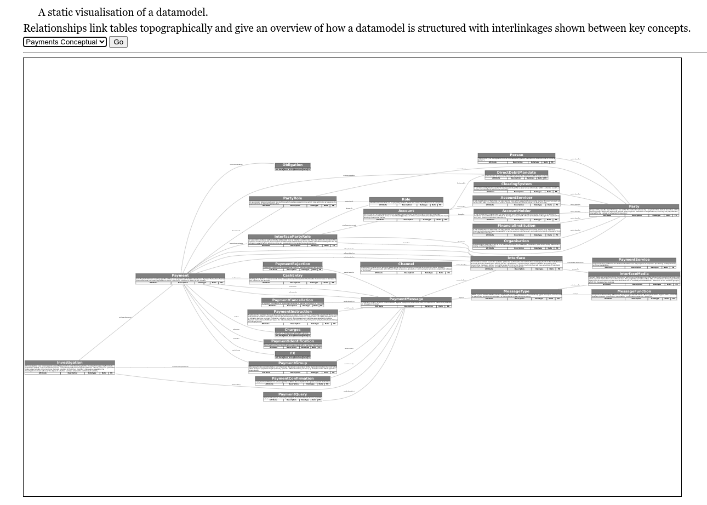

# datamodels

(name under review!)

## Multiple Features Including:

* Serializer pattern for transcribing tabular data into well-formed rdf models
    i. Each pre-built model can have multiple "serializations" used to transcribe tabular data into rdf-model form
* Discourse model for handling differing views and perspectives and contradictions between them
* Pre-built graph model for datamodels - Entity Relationship Models
* Other models/ontologies in progess covering other data-modelling topics, as well as a range of enterprise architecture templates.
* Functions for producing layout and use-case appropriate visualisations
    i. Difference layout: Given two models, visually show old, constant, and new objects after performing a diff.
    ii. Timeline sequence: Given a sequence of models, generate a series of difference layouts showing transitions over time. 
    iii. ERD model layout - for presenting Entity Relationship Diagrams from data
    iv. Arch model layout - for presenting Arch Model Diagrams from data

## Quick Setup

### Fuseki dependency

Download and install fuseki-jena from here: https://jena.apache.org/download/
Start fuseki with `fuseki-server` command in main fuseki install directory
If not already present, create a fuseki datasource called `modelg` from the fuseki front-end. htto://localhost:3030

## An ontology and associated code for working with data models

One requirement behind datamodels aka *modelg* is to be able to easily and rapidly ingest a collection of datamodels from a range of sources and authoring tools into a single location.

This might be in the context of performing some analysis, or prior to a migration from one set of data modelling tooling to another.

An ontology specifies a set of serialization schemas which, along with the associated python code, allows upload of contents from relatively simple csv-style data feeds.

A serialization feeds supplied data into a *discourse* which enables validation and agreement to be performed prior to inclusion in a more formalised graph.

## Gallery

Discourse Ontology

Data Modelling Ontology

Datamodel Layout

